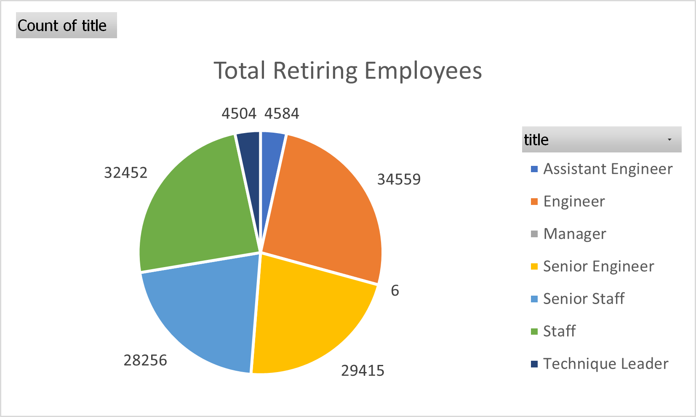
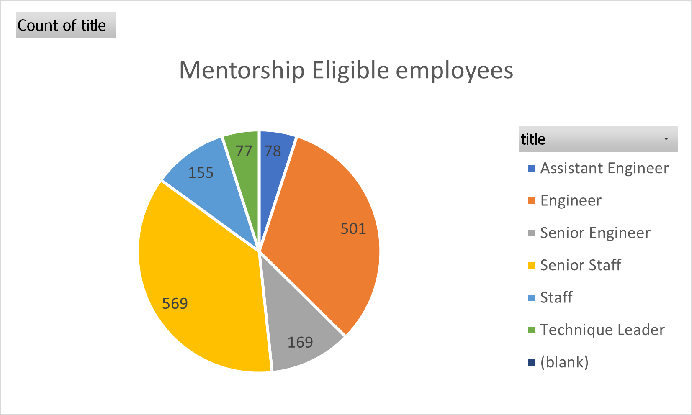
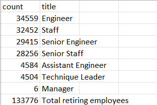
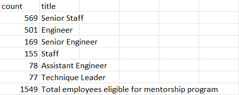

# Pewlett Hackard Employee Research Analysis

## Project Overview

Pewlett Hackard ‘s HR department has assigned me to perform employee research analysis based on established data with the goal of identifying employees who will be retiring next year, as well as determining employees who are eligible to participate in our mentorship program. In addition to the historical data, I used SQL to build a database by applying data modelling, engineering, and analytical skills to deduce how many roles will need to be filled as the "silver tsunami" begins to make an impact? This analysis will provide the company with the necessary insights to identify whether there are enough qualified, retirement-ready employees in the departments to mentor the next generation of Pewlett Hackard employees and improve upon the current mentorship program.

## Resources
- Data Sources: departments.csv, dept_emp.csv, dept_manager.csv, employees.csv, salaries.csv, titles.csv
<!-- [.csv](/folder.csv) -->

- Software: PostgreSQL 14.5, pgAdmin, Quick DBD

## Results

The results of the analysis highlighted by the images above lead to the following points:
-	133,776 employees will be retiring shortly
-	1,549 employees are eligible for the mentorship program
-	Engineers make up the largest numbers of retiring employees 
-	Managers make up the lowest numbers of retiring employees

## Summary

Total Retiring Employees

Total Mentorship Eligible Employees

The employee research analysis predicts that 132,227 roles will need to be filled as the "silver tsunami" begins to make an impact. The analysis also shows that with a total of 133,776 retiring employees, there are enough qualified, retirement-ready employees in the departments to mentor the next generation of Pewlett Hackard employees.
